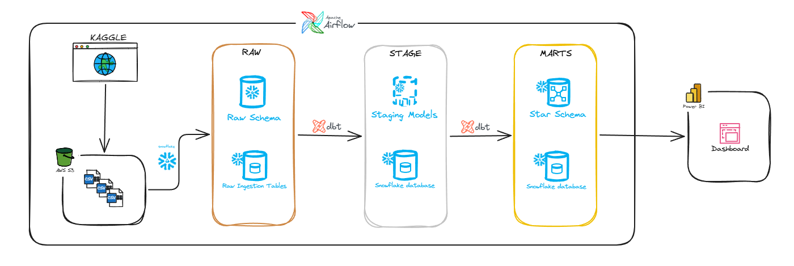
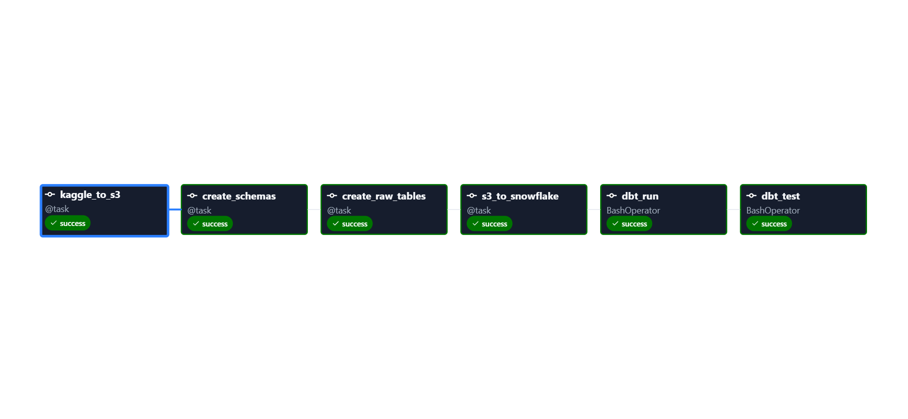
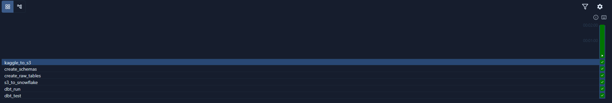
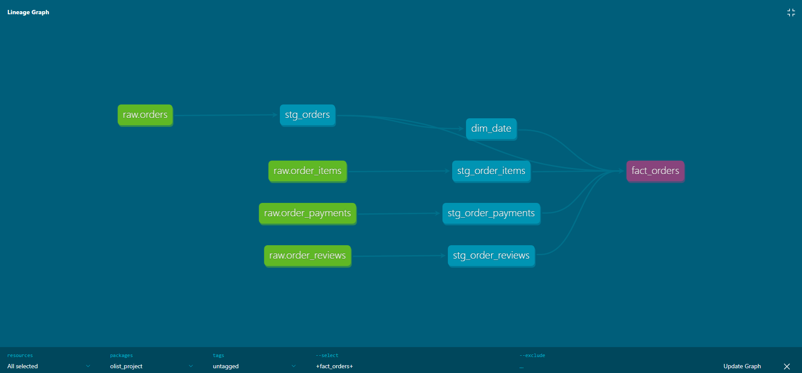
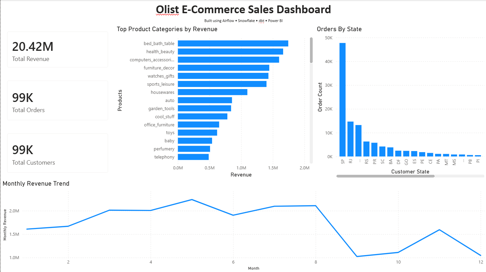

# Olist End-to-End Data Engineering Pipeline

A production-style end-to-end data engineering pipeline built using the modern data stack.

This project ingests raw e-commerce data from Kaggle, stores it in cloud storage, loads it into a cloud warehouse, transforms it using dbt, orchestrates workflows with Airflow, and serves analytics through Power BI dashboards.

---

## Architecture Overview



### Pipeline Flow

```text
Kaggle Dataset
      ↓
AWS S3 (Raw CSV Storage)
      ↓
Airflow Orchestration
      ↓
Snowflake RAW Schema
      ↓
dbt STAGE Models
      ↓
dbt MARTS Models (Star Schema)
      ↓
Power BI Dashboard
```

---

## Tech Stack

* Apache Airflow
* AWS S3
* Snowflake
* dbt
* Power BI
* Python
* SQL

---

## Project Objective

Build a scalable ELT pipeline that simulates a real-world e-commerce analytics platform by:

* Extracting raw transactional data from Kaggle
* Storing raw files in cloud object storage
* Loading data into Snowflake warehouse
* Transforming data into analytics-ready models using dbt
* Orchestrating pipeline execution using Airflow
* Building KPI dashboards for business insights

Dataset used:

https://www.kaggle.com/datasets/olistbr/brazilian-ecommerce

---

# Data Pipeline Architecture

## 1. Data Ingestion Layer

Source data is downloaded from Kaggle automatically using Python and uploaded to AWS S3.

Pipeline:

```text
Kaggle → Python → AWS S3
```

Files ingested:

```text
customers.csv
orders.csv
products.csv
payments.csv
reviews.csv
sellers.csv
order_items.csv
geolocation.csv
```

Responsibilities:

* Kaggle API authentication
* Dataset download automation
* CSV extraction
* Upload files to S3 bucket

---

## 2. Workflow Orchestration

Pipeline orchestration is handled using Apache Airflow.

DAG scheduling:

```text
Daily
```

Features implemented:

```text
Task dependency management
Automatic retries
Failure handling
Scheduled execution
Pipeline monitoring
```

Airflow DAG:

```text
kaggle_to_s3
      ↓
create_schemas
      ↓
create_raw_tables
      ↓
s3_to_snowflake
      ↓
dbt_run
      ↓
dbt_test
```

### Airflow DAG Screenshot



### Successful DAG Run



---

## 3. Data Warehouse Layer

Cloud warehouse used:

Snowflake

Warehouse structure:

```text
OLIST Database
```

Schemas:

```text
RAW
STAGE
MARTS
```

### RAW Schema

Contains raw ingested source tables.

```text
customers
orders
products
payments
reviews
sellers
order_items
geolocation
```

Purpose:

Stores unprocessed source data exactly as received.

---

### STAGE Schema

Created using dbt staging models.

Purpose:

* Data cleaning
* Column renaming
* Type conversions
* Null handling
* Standardization

Example models:

```text
stg_orders
stg_customers
stg_products
```

---

### MARTS Schema

Contains analytics-ready business models.

Purpose:

* Business reporting
* Star schema design
* Fact + Dimension modeling

Models:

```text
fact_orders
dim_customers
dim_products
dim_sellers
dim_date
```

---

## Star Schema Design



```text
                dim_customers
                     |
                     |
dim_products --- fact_orders --- dim_sellers
                     |
                     |
                  dim_date
```

Fact table:

```text
fact_orders
-----------
order_id
customer_id
product_id
seller_id
date_id
payment_value
freight_value
price
review_score
```

---

## 4. Data Transformation Layer

Transformation framework:

dbt

dbt responsibilities:

* Cleaning source data
* Creating staging models
* Building dimension tables
* Building fact tables
* Applying transformations
* Testing data quality

Tests implemented:

```text
not_null
unique
accepted_values
relationship tests
```

Commands used:

```bash
dbt run
dbt test
```

---

## 5. Analytics Dashboard

Dashboard built using Power BI.

KPIs created:

```text
Total Revenue
Total Orders
Total Customers
Monthly Revenue Trend
Top Product Categories by Revenue
Orders by State
```

### Dashboard Screenshot



Business insights generated:

* Monthly revenue trends
* Best performing product categories
* High performing customer regions
* Customer order behavior
* Sales performance monitoring

---

# Project Structure

```text
Olist Business Metrics Warehouse/
│
├── dags/
│   ├── olist_pipeline.py
│   └── s3_ingestion.py
│
├── olist_project/
│   ├── models/
│   │   ├── marts/
│   │   │   ├── dim_customers.sql
│   │   │   ├── dim_date.sql
│   │   │   ├── dim_products.sql
│   │   │   ├── dim_sellers.sql
│   │   │   ├── fact_orders.sql
│   │   │   └── schema.yml
│   │   ├── sources/
│   │   │   └── sources.yml
│   │   └── stage/
│   │       ├── stg_customers.sql
│   │       ├── stg_geolocation.sql
│   │       ├── stg_order_items.sql
│   │       ├── stg_order_payments.sql
│   │       ├── stg_order_reviews.sql
│   │       ├── stg_orders.sql
│   │       ├── stg_product_category_name_translation.sql
│   │       ├── stg_products.sql
│   │       └── stg_sellers.sql
│   └── dbt_project.yml
│
├── sql/
│   ├── ddl/
│   │   ├── customers.sql
│   │   ├── geolocation.sql
│   │   ├── order_items.sql
│   │   ├── order_payments.sql
│   │   ├── order_reviews.sql
│   │   ├── orders.sql
│   │   ├── product_category_name_translation.sql
│   │   ├── products.sql
│   │   └── sellers.sql
│   └── setup/
│       ├── copy_into.sql
│       ├── create_schemas.sql
│       └── resources.sql
│
├── .env
├── .gitignore
├── docker-compose.yaml
├── requirements.txt
└── README.md
```

---

# Technical Skills Demonstrated

* Python scripting
* SQL development
* Workflow orchestration
* Cloud storage integration
* Cloud data warehousing
* ELT pipeline development
* Data modeling
* dbt transformations
* Data quality testing
* Dashboard development
* Business intelligence reporting

---

# Future Improvements

* Incremental loading instead of full refresh
* Docker containerization
* CI/CD pipeline deployment
* Data quality monitoring framework
* Slack/email alerts for pipeline failures
* Terraform infrastructure automation
* Kafka streaming ingestion

---

# Key Learnings

Through this project I gained hands-on experience with:

* Building production-style ELT pipelines
* Orchestrating workflows with Airflow
* Managing warehouse schemas in Snowflake
* Designing star schema data models
* Transforming data using dbt
* Building business dashboards in Power BI
* Working with modern data stack tools

---

# Tech Stack Summary

| Layer          | Technology     |
| -------------- | -------------- |
| Orchestration  | Apache Airflow |
| Cloud Storage  | AWS S3         |
| Data Warehouse | Snowflake      |
| Transformation | dbt            |
| Dashboard      | Power BI       |
| Language       | Python         |
| Query Language | SQL            |

---

# Author

**Raj Kiran G S**

